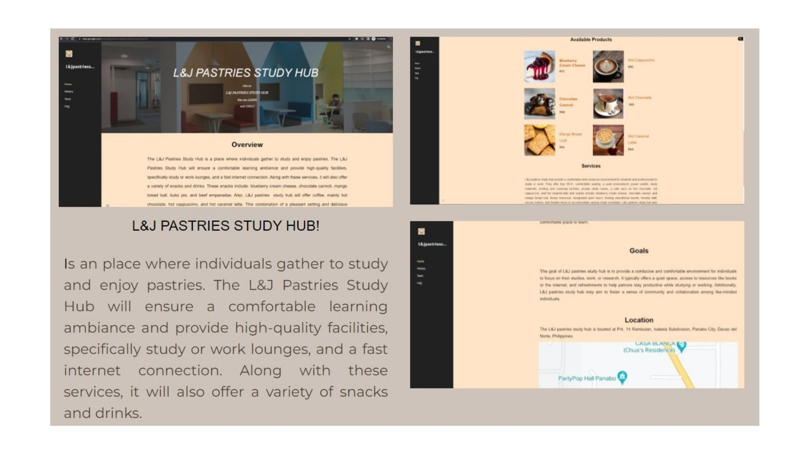
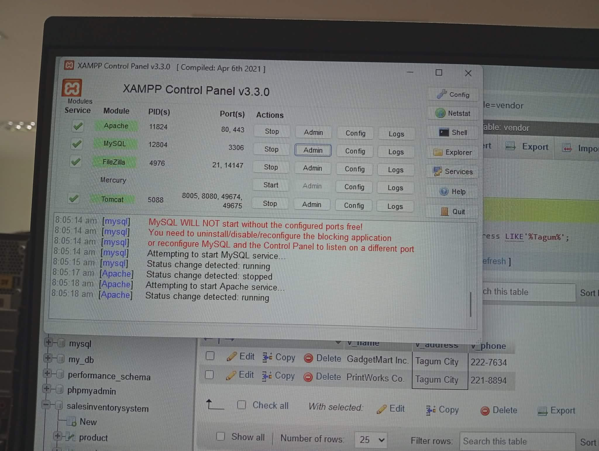
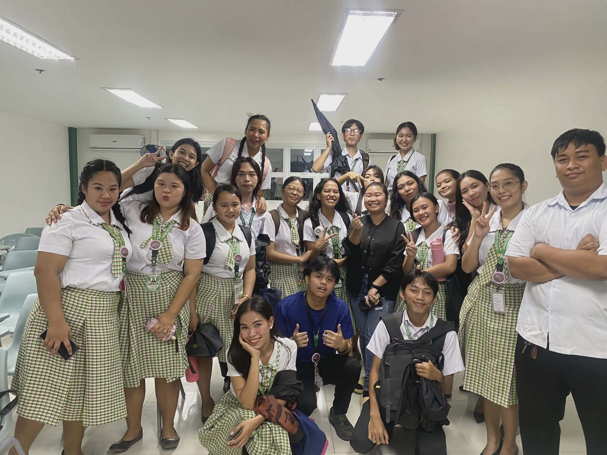
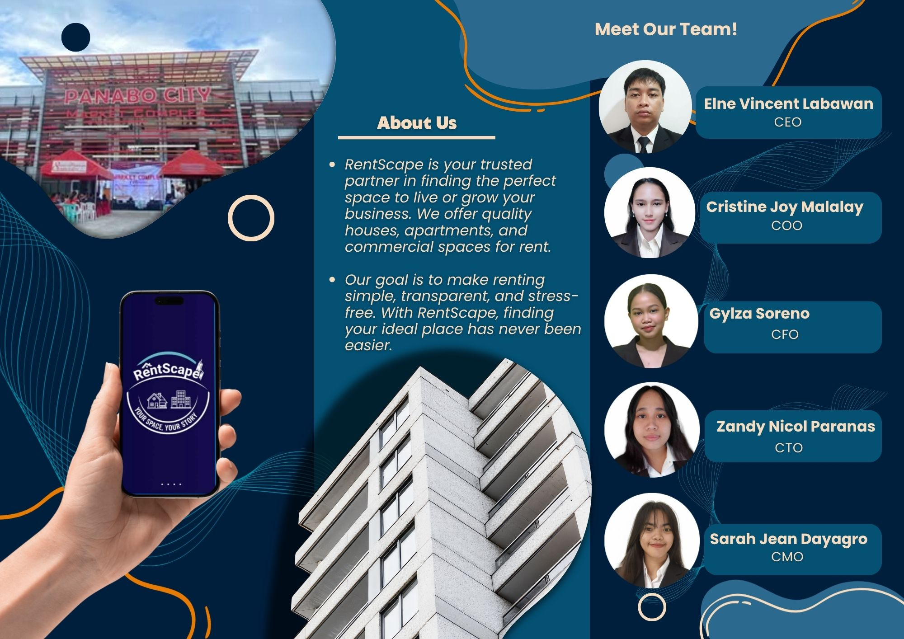
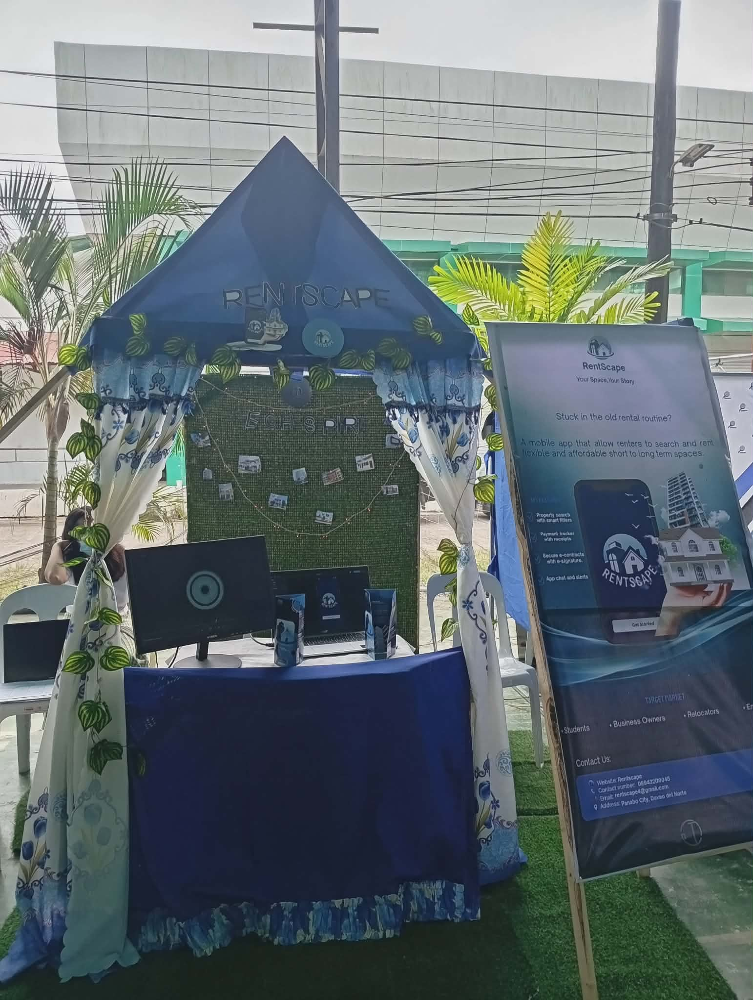
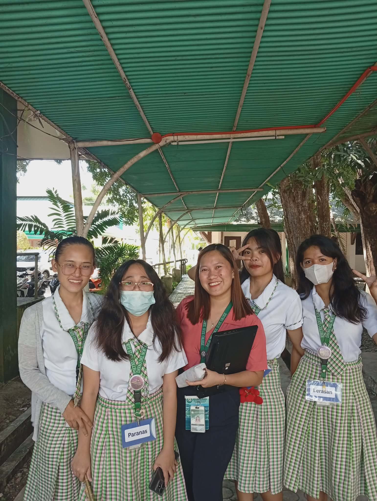
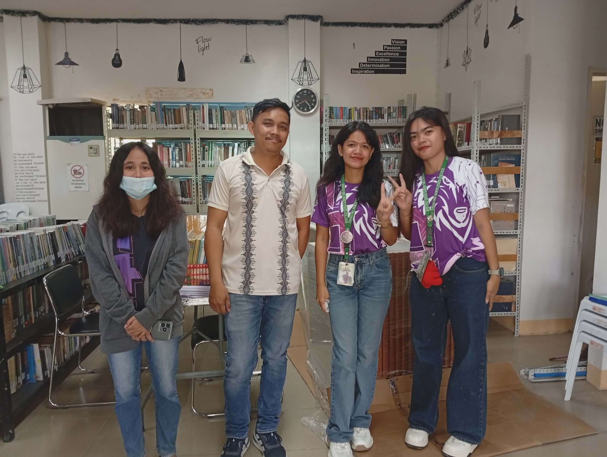
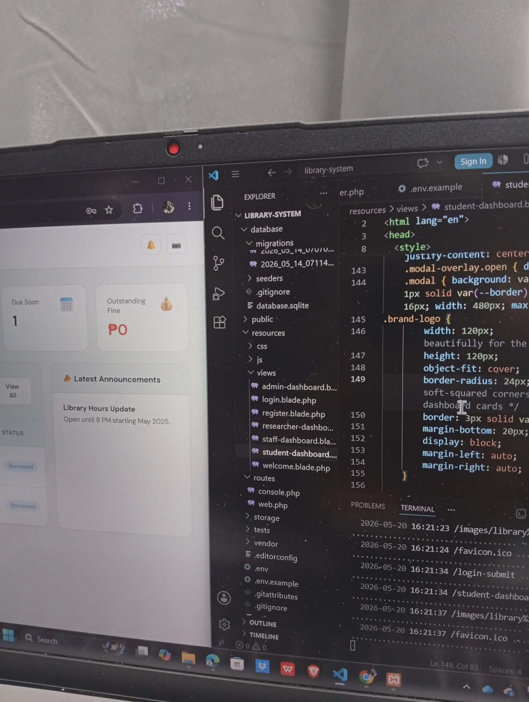
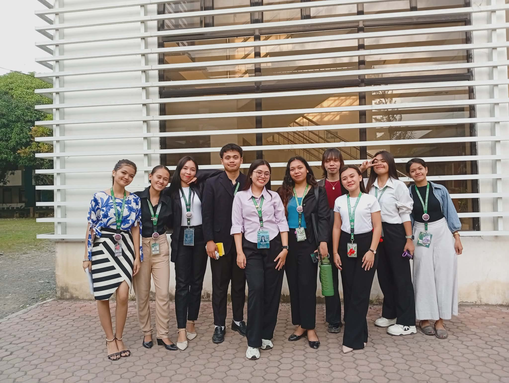
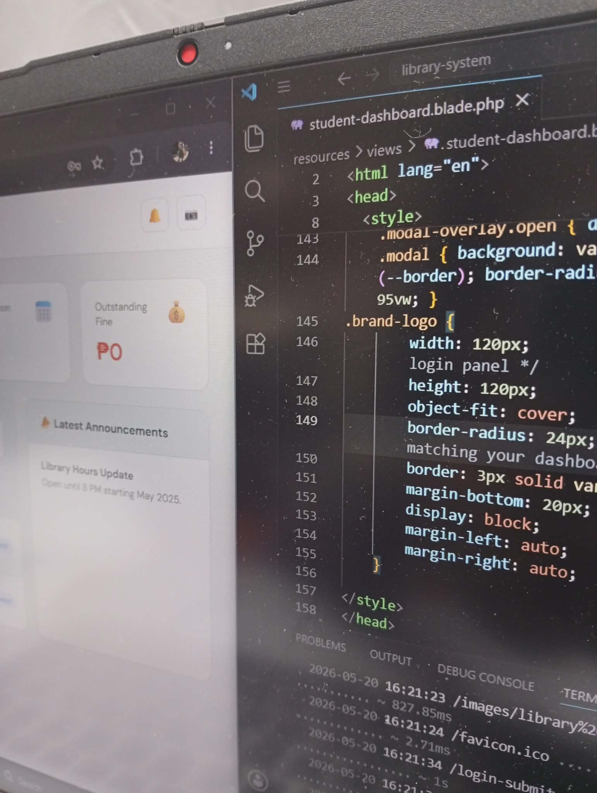

<!-- GLOBAL STYLING ENGINE -->

  <!-- HEADER NAVIGATION -->
  

    
Sarah Jean Dayagro

    

      
        <b><a href="#home" style="color: var(--text-light); text-decoration: none; margin-left: 20px;">Home</a></b>
        <b><a href="#timeline" style="color: var(--text-light); text-decoration: none; margin-left: 20px;">Works</a></b>
        <b><a href="#contact" style="color: var(--text-light); text-decoration: none; margin-left: 20px;">Contact</a></b>
      
    

  

  <!-- HERO PRESENTATION MODULE -->
  

    

      <h3 style="color: var(--accent-mint); font-size: 13px; letter-spacing: 2px; margin-bottom: 5px;">INFORMATION SYSTEMS STUDENT | SYSTEMS ANALYST</h3>
      <h1 style="font-size: 48px; color: var(--accent-gold); margin-bottom: 10px; line-height: 1.1;">Portfolio</h1>
      <h2 style="font-size: 18px; color: var(--text-gray); margin-bottom: 20px; font-weight: normal;">Hi, I'm Sarah Jean Dayagro!</h2>
      

        A 3rd-year Bachelor of Science in Information Systems student at Davao del Norte State College. 
        I specialize in analyzing complex technical requirements, formulating structural entity-relationship database schemas, and engineering comprehensive software configurations that optimize enterprise operational workflows.
      

      

        Systems Analysis / System Developer
        MySQL / phpMyAdmin
      

    

    

      
      
Sarah Jean Dayagro

    

  

  

  <!-- MATRIX TIMELINE SECTION -->
  

    <h2 style="font-size: 26px; color: var(--accent-gold); margin-bottom: 5px;">Outputs from 1st Year to 3rd Year</h2>
    
A systematic log detailing my technical training progress, interactive web developments, and data engineering projects at DNSC.

    <!-- 1ST YEAR EXTENDED HUB -->
    

      1st Year Foundations
      <h3 style="font-size: 22px; color: var(--accent-gold); margin-bottom: 10px;">Multimedia Short Films, Desktop Engineering & Early Web Architecture</h3>
      

        My first year centered on programming logic foundations, desktop UI modeling, introductory computing designs, and digital storytelling projects. I built a dynamic set of projects traversing software engineering and creative multimedia.
      

      

        <!-- Short Films -->
        

          
          <h5 style="color: var(--accent-mint); font-size: 15px; margin-bottom: 5px;">Multimedia Production: LUCID</h5>
          
Co-directed and edited **LUCID**, a student short film that earned a *Best Support Artist* award. Also produced **Part of Your World**, a detailed group music video recreation setup.

        

        <!-- Diwata Pares -->
        

          
          <h5 style="color: var(--accent-mint); font-size: 15px; margin-bottom: 5px;">Diwata Pares Overload Order App</h5>
          
Programmed a standalone food ordering application featuring intuitive menu navigation item matrix boxes, individual price controls, and real-time total checks generation tools.

        

        <!-- L&J Pastries -->
        

          
          <h5 style="color: var(--accent-mint); font-size: 15px; margin-bottom: 5px;">L&J Pastries Study Hub Platform</h5>
          
Engineered a cafe platform mockup including specialized product grid displays for treats alongside spatial coordinate sections mapping quick-access internet connection areas.

        

      

      

        <!-- Programming 1 Java -->
        

          
          <h5 style="color: var(--accent-mint); font-size: 15px; margin-bottom: 5px;">Programming 1: Java Core Final</h5>
          
Constructed programmatic console logic setups, syntax loops, and error exceptions checking while thoroughly mastering object testing and script debugging workflows.

        

        <!-- Vector Art -->
        

          
          <h5 style="color: var(--accent-mint); font-size: 15px; margin-bottom: 5px;">Introduction to Computing Designs</h5>
          
Designed symmetrical vector illustration elements and digital graphical schemas inside foundational core classes, detailing robot shapes and pattern layouts.

        

        <!-- Programming 2 -->
        

          
          <h5 style="color: var(--accent-mint); font-size: 15px; margin-bottom: 5px;">Programming 2 System Showcase</h5>
          
Advanced interface implementation testing object-oriented design matrices. Completed full logic testing phases alongside a successful presentation board evaluation.

        

      

      <h4 style="color: var(--accent-mint); font-size: 16px; margin-top: 25px; margin-bottom: 8px;">Local Database Architectures (XAMPP Environment)</h4>
      

        Provisioned local Apache hosting networks and crafted relational database tables. Compiled structural validation constraints and constructed clean entity metrics using target MySQL scripts.
      

      

        
        
      

    

    <!-- 2ND AND 3RD YEAR EQUAL GRID -->
    

      
      <!-- SECOND YEAR CARD -->
      

        

          2nd Year Milestones
          <h3 style="font-size: 20px; color: var(--accent-gold); margin-bottom: 8px;">Quantitative Research Poster Showcase</h3>
          

            Co-authored, statistically modeled, and formulated a quantitative research project evaluating computing role trends and perceptions at DNSC. Successfully presented and defended the thesis project, securing <b>2nd Place Best Poster Design</b> at the Institute of Computing Symposium.
          

          <h4 style="font-size: 15px; color: var(--accent-mint); margin-top: 15px; margin-bottom: 5px;">Code Layout Debugging & HCI</h4>
          

            Analyzed underlying stylesheet layouts to master front-end error tracking protocols. Successfully resolved structural alignment flaws, parent container constraints, and complex grid-template boundaries.
          

        

        

          
          
          
          
        

      

      <!-- THIRD YEAR CARD -->
      

        

          3rd Year Enterprise Solutions
          <h3 style="font-size: 20px; color: var(--accent-gold); margin-bottom: 8px;">RentScape: Mobile Space Allocation Platform</h3>
          

            Co-engineered an end-to-end mobile application framework designed to automate property discovery, vacancy metrics tracking, and tenant data handling for apartments and boarding systems in Panabo City. Showcased at the <b>Startup Sundayag 2025 Exhibition</b>, receiving formal certification for its exceptional operational design strategy and requirements blueprinting.
          

          <ul style="margin-left: 15px; font-size: 13px; color: var(--text-gray); margin-top: 10px;">
            <li><b>System Logic:</b> Enabled custom query filter routing and secure logging tracks.</li>
            <li><b>Technical Layout:</b> Designed stylized multi-page marketing flyers and technical data asset layouts.</li>
          </ul>
        

        

          
          
          
        

      

    

    <!-- PIPELINES SPECIFICATIONS AND ACTIVE DESIGNS -->
    

      <h4 style="font-size: 16px; color: var(--accent-gold); text-transform: uppercase; letter-spacing: 1px; margin-bottom: 15px;">Active High-Tier System Proposals</h4>
      

        <!-- Buzzify -->
        

          <h5 style="font-size: 16px; color: var(--accent-mint); margin-bottom: 8px;">Buzzify: Web Marketing Platform</h5>
          

            A specialized web-based application built to enhance digital marketing workflows and brand visibility metrics for the Greater RJ Appliance & Trading Corporation. Finalized requirements coordination and corporate stakeholder pitching modules.
          

          

            
            
          

        

        <!-- E-Library -->
        

          <h5 style="font-size: 16px; color: var(--accent-mint); margin-bottom: 8px;">E-Library Portal & Registration</h5>
          

            An automated platform engineered for the Panabo City Library to streamline visitor registration and workstation monitoring. Integrates barcode/QR code authentication paths for seamless real-time usage data reports tracking.
          

          

            
            
          

        

      

    

  

  <!-- FOOTER REGISTRATION GRID -->
  

    
    <!-- CONTACT SECTION -->
    

      <h3 style="font-size: 22px; color: var(--accent-gold); margin-bottom: 5px;">Get In Touch</h3>
      <h4 style="font-size: 16px; color: var(--accent-mint); margin-bottom: 15px; border-bottom: 1px solid var(--blue-slate); padding-bottom: 8px;">Contact & Networks</h4>
      
<b>📞 Phone Contact:</b> +63 965 083 8942

      
<b>✉️ Email Address:</b> <a href="mailto:sarahjean.dayagro@gmail.com">sarahjean.dayagro@gmail.com</a>

      
<b>📍 Location Address:</b> Panabo City, Davao del Norte, Philippines

      
      <h4 style="font-size: 16px; color: var(--accent-mint); margin-top: 25px; margin-bottom: 12px; border-bottom: 1px solid var(--blue-slate); padding-bottom: 8px;">Professional Channels</h4>
      
<b>💼 LinkedIn Profile:</b> <a href="#">linkedin.com/in/sarah-jean-dayagro</a>

      
<b>🏫 Institutional Site:</b> <a href="https://dnsc.edu.ph" target="_blank">Davao del Norte State College</a>

    

    <!-- RUNNING ARCHIVES GALLERY -->
    

      <h3 style="font-size: 18px; color: var(--accent-gold); margin-bottom: 15px;">Institutional Operations Gallery</h3>
      

        
        
        
        
      

    

  

  <!-- BOTTOM BAR FOOTER -->
  

    
© 2026 Sarah Jean Dayagro · Formatted via Integrated Custom Engines for GitHub README

  

