# 💻 Information Systems Portfolio

### Sarah Jean Dayagro
**Information Systems Student | Systems Analyst**
*Davao del Norte State College*

---

## 👤 About Me
A 3rd-year Bachelor of Science in Information Systems student at Davao del Norte State College. I am dedicated to analyzing technical user and organizational requirements, designing relational entity-relationship database schemas, and engineering web applications that optimize operational productivity.

### 🛠️ Core Skills
* 📊 Systems Analysis / System Development
* 🗄️ Relational Database Design (MySQL / phpMyAdmin)
* ⚙️ Local Server Administration (XAMPP Environment)

---

## 📈 Academic & System Development Timeline

### 🥇 1st Year Foundations
#### Multimedia Short Films, Desktop Engineering & Early Web Architecture
My first year centered on programming logic foundations, desktop UI modeling, introductory computing designs, and digital storytelling projects. I built a dynamic set of projects traversing software engineering and creative multimedia.

| Project | Description | Output Preview |
| :--- | :--- | :---: |
| **Multimedia Production** | Co-directed, filmed, and edited **LUCID**, a short film project that won a *Best Support Artist* award. Also created **Part of Your World**, a detailed group music video recreation. | 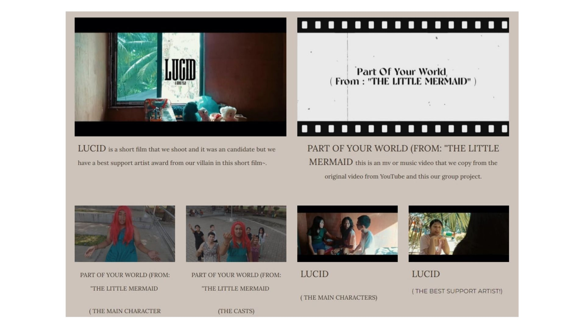 |
| **Diwata Pares Overload Order System** | Designed and programmed a standalone food order system desktop application with menu navigation matrices and real-time total checkout calculation sheets. | 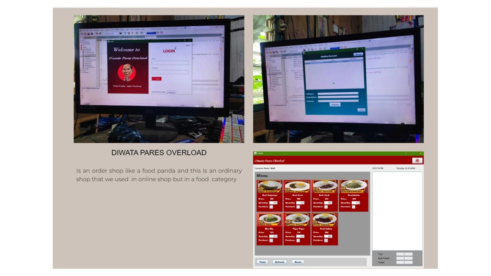 |
| **L&J Pastries Study Hub Platform** | Engineered a mockup web architecture for an interactive study cafe with specialized product grids and quick-access internet connection lounge blocks. |  |
| **Programming 1: Java Core** | Final activity embarking on console logic setups, loop structures, and structural file debugging configurations. | 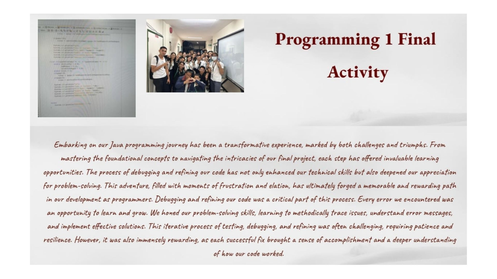 |
| **Introduction to Computing Designs** | Constructed digital vector illustrations and layout mockups, designing symmetrical robot interfaces. | 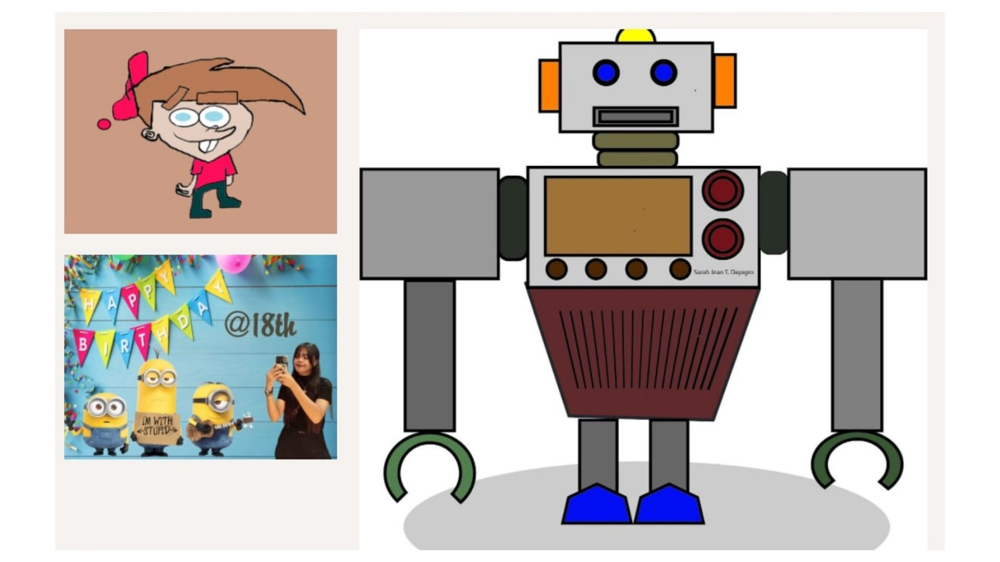 |
| **Programming 2 Final Project** | Culminating programming final project testing advanced object-oriented workflows and interface development. | 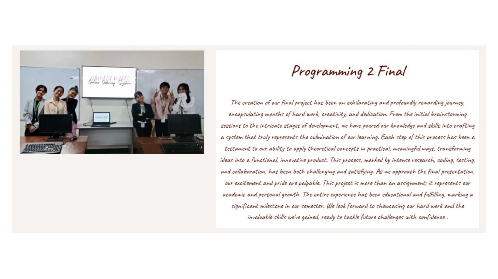 |

#### Local Database Architectures (XAMPP Environment)
Provisioned local Apache hosting networks and crafted relational database tables. Compiled structural validation constraints and constructed clean entity metrics using target MySQL scripts.

| Apache Server Configuration | phpMyAdmin SQL Console |
| :---: | :---: |
| 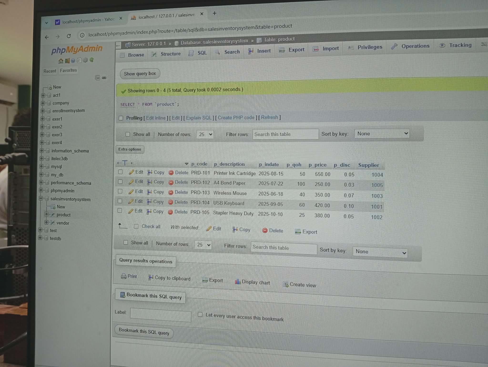 |  |

---

### 🥈 2nd Year Milestones
#### Quantitative Research Poster Showcase & HCI Debugging
Co-authored, statistically modeled, and formulated a quantitative research project evaluating computing role trends and perceptions at DNSC. Successfully presented and defended the thesis project, securing **2nd Place Best Poster Design** at the Institute of Computing Symposium.

Analyzed underlying stylesheet layouts to master front-end error tracking protocols. Successfully resolved structural alignment flaws, parent container constraints, and complex grid-template boundaries.

| Research Poster Design | Symposium Winner Certificate | CSS Grid Debug Window | Layout Alignment Testing |
| :---: | :---: | :---: | :---: |
| 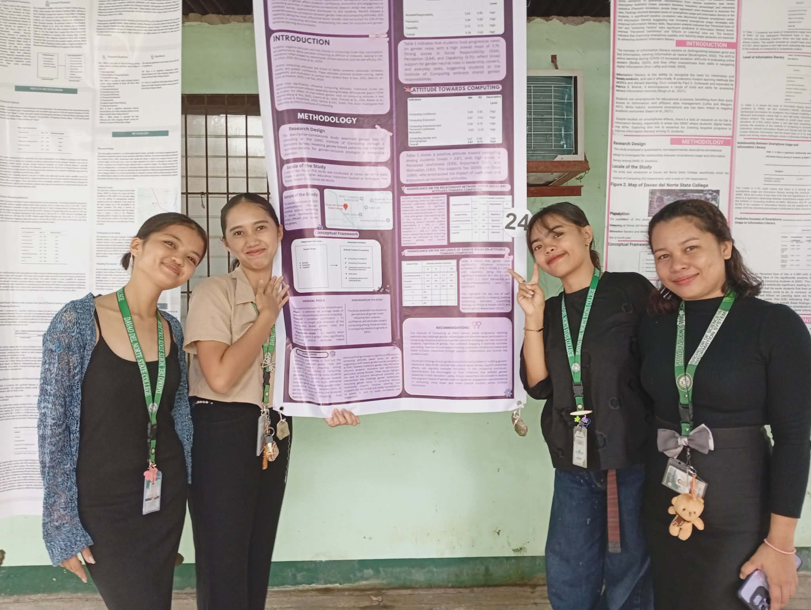 |  | 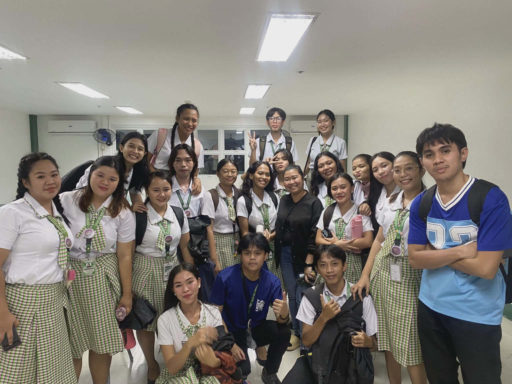 |  |

---

### 🥉 3rd Year Enterprise Solutions
#### RentScape: Mobile Property Allocation Platform
Co-engineered an end-to-end mobile application framework designed to automate property discovery, vacancy metrics tracking, and tenant data handling for apartments and boarding systems in Panabo City. Showcased at the **Startup Sundayag 2025 Exhibition**, receiving formal certification for its exceptional operational design strategy and requirements blueprinting.

| RentScape Overview | Technical Features | Exhibition Booth Stand |
| :---: | :---: | :---: |
|  | 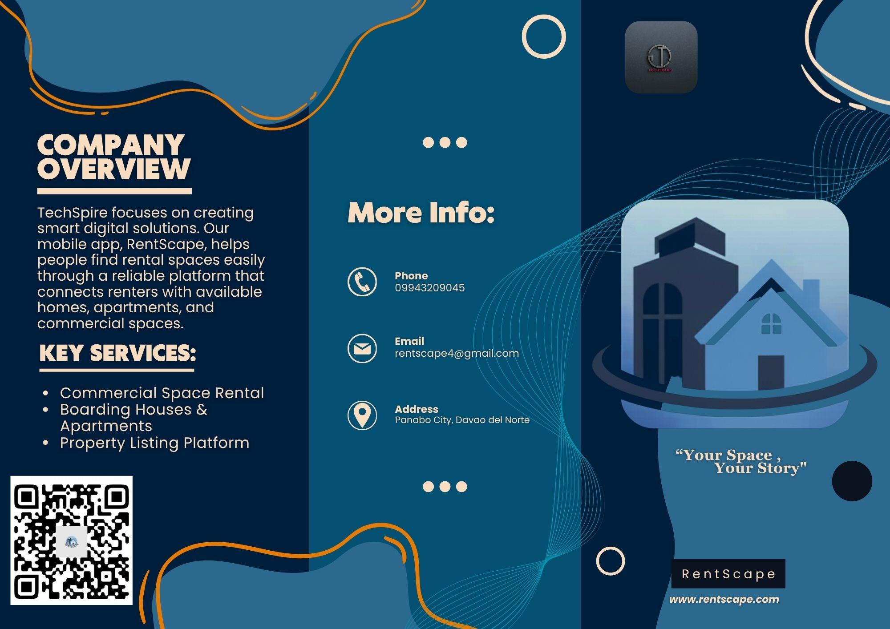 |  |

---

## 🚀 Active High-Tier System Proposals

### 1. Buzzify: Web Marketing Platform
A specialized web-based application built to enhance digital marketing workflows and brand visibility metrics for the Greater RJ Appliance & Trading Corporation. Successfully finalized core stakeholder requirements and business logic pitching.

| Field Requirement Gathering | Strategy Pitch Presentation |
| :---: | :---: |
| 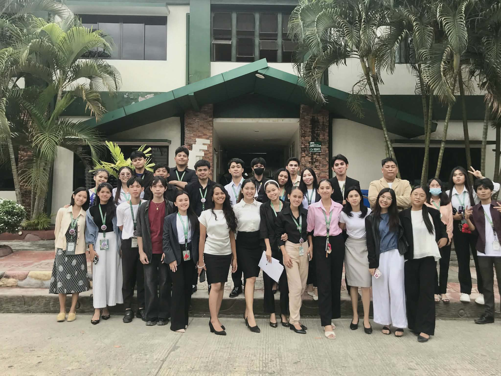 |  |

### 2. E-Library Portal & Registration
An automated platform engineered for the Panabo City Library to streamline visitor registration and workstation monitoring. Integrates barcode/QR code authentication paths for fluid analytics reporting.

| Dashboard Source Integration | File Directory Layout Map |
| :---: | :---: |
|  |  |

---

## 🏛️ Institutional Operations Gallery
| Systems Requirements Defense | Library Workstation Review | Library Field Coordination | System Validation Iteration |
| :---: | :---: | :---: | :---: |
|  | 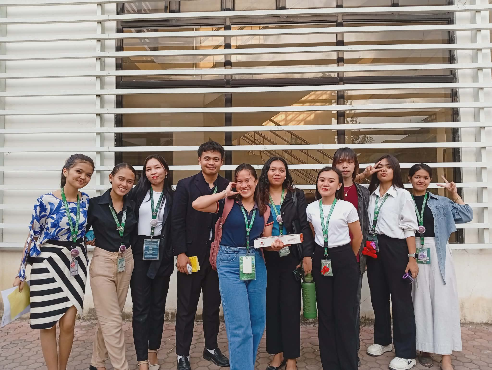 |  |  |

---

## 📞 Get In Touch
* **📞 Mobile:** +63 965 083 8942
* **✉️ Email:** sarahjean.dayagro@gmail.com
* **📍 Location:** Panabo City, Davao del Norte, Philippines
* **💼 LinkedIn:** [linkedin.com/in/sarah-jean-dayagro](#)
* **🏫 Institution:** [Davao del Norte State College](https://dnsc.edu.ph)
